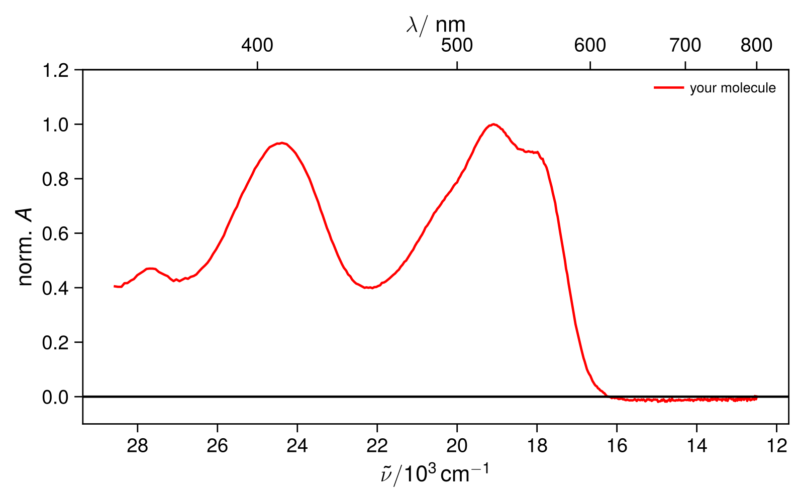
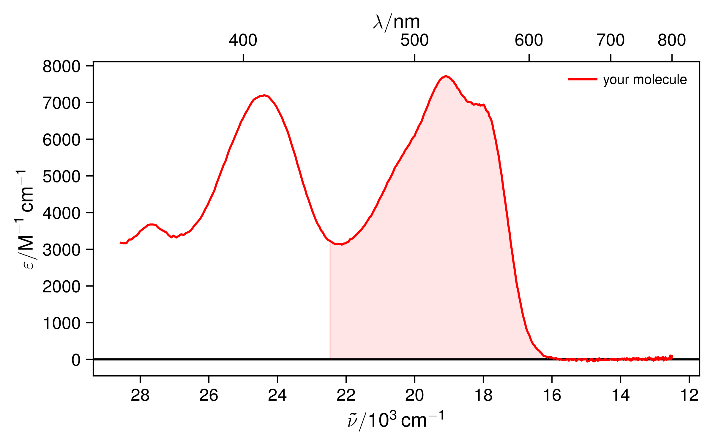

# Pyrene

**Object-oriented Python toolkit for (spectroscopic) data analysis** for steady-state and time-resolved spectroscopy, cyclic voltammetry, and QM/MD workflows developed during my PhD at the Vauthey Group (University of Geneva).  

---

## 1. Overview

This package provides modular, object-oriented tools for handling and analyzing experimental data. Objects are created for each type of experiment or analysis technique, while the mathematical processing and analysis happens in the background. 

The pacakge is mainly dedicated for personal use by myself and as of now documentation is sparse. However, as some colleagues were interested in some of the capabilites of this package, e.g. how to easily render movies out of time-resolved spectra (see below), I decided to share it here on GitHub.

Templates/explanatory examples for common data analysis workflows are available in `pyrene/examples`

> Note: As documentation is currently sparse, for more detailed guidance on the capabilities of the package, best to talk to me directly. I can show you how to use it and explain what happens under the hood.

---

## 2. Installation

I chose to develop **Pyrene** using the modern Python package manager `uv` with Python 3.12.

Why use yet another environment manager if there is already a plethora of them out there (`conda`, `mamba`, ...)? It can feel a bit annoying at first, but the idea is simple:

> You will install the exact same python environment as me, with minimal effort and fully reproducible results.

This reduces setup issues and avoids the classic *“it works on my machine”* problem.

If you do not want to use `uv`, you can still install Pyrene in a traditional way using `venv` and `pip` after cloning the repository.

---

### What is `uv`?

[`uv`](https://docs.astral.sh/uv/) is a modern Python packaging and environment tool written in Rust. It is designed to replace and unify tools such as `pip`, `virtualenv`, and parts of `poetry`.

Compared to traditional Python workflows, `uv` is:

-  **Extremely fast** — significantly faster than pip-based workflows  
-  **Reproducible** — uses a lockfile (`uv.lock`) to ensure identical environments  
-  **Environment-aware** — automatically manages virtual environments  
-  **Simple** — combines multiple tools into one unified interface  

In short: `uv` makes Python project setup faster, more reliable, and fully reproducible across systems.

---

### Installation (recommended: uv workflow)

```bash
git clone https://github.com/johanneswega/pyrene.git
cd pyrene
uv sync
```

This will:

- create a virtual environment automatically (`.venv` folder)
- install all dependencies from `pyproject.toml`
- ensure version consistency via `uv.lock`

You can then activate the environment:

```bash
source .venv/bin/activate
```

### Alternative installation (no uv required)

```bash
git clone https://github.com/johanneswega/pyrene.git
cd pyrene

# use your favorite tool to create a venv
python3.12 -m venv venv
source venv/bin/activate

pip install .
```

### LaTeX

You should also make sure to have LaTeX installed in your machine, as I use it for pretty axis labels. Anyways you should have LaTeX already 
installed if you respect yourself as a scientist. 

---

## 3. Usage Example

For example, if you measured an absorption spectrum on our Cary50 spectrometer (`abs_file1.csv`), you can plot it using the `Absorption` class from `pyrene.steady_state`:

```python
from pyrene.steady_state import Absorption

a = Absorption(
    files=['abs_file1.csv'],
    x_cuts=[(350, 800)],
    wn=True,
    colors=['r'],
    norm=[True],
    labels=['your molecule'])

a.show()
```

<p align="center">
  
</p>

In essentially all objects, arguments like `files`, `cuts`, `colors`, and `labels` are given as **lists**. This makes it easy to plot and compare multiple spectra in the same figure.

You can also directly access the loaded data and analyze it with your own custom code. For example, the $x$ and $y$ data of the plot (here $x$ = wavenumber, $y$ = absorbance) of the *i-th* file are stored as NumPy arrays:
```python
wavenumber = a.x[i]
absorbance = a.y[i]
```

However, most of the classes are not just for plotting. Most of them come with built-in analysis methods. Say you want to estimate the oscillator strength and radiative rate constant for the $S_1 \leftarrow S_0$ transition by integrating the absorption spectrum between 16-22.5 kK using the Strickler-Berg analysis. For this, you just need to pass two extra arguments when creating the Absorption object:
- `c` → concentration in M
- `l` → optical pathlength in cm

With these two additional init arguments, the class will directly calculate the extinction spectrum. To calcualte the oscillator strength you can then call `calc_oscillator_strength()` method of the class: 

```python
from pyrene.steady_state import Absorption

# concentration in M
conc = 24e-6
# pathlength in cm
pathlength = 1

# initialize absorption class
a = Absorption(files=['abs_file1.csv'],
                x_cuts=[(350, 800)],
                colors=['r'],
                c=[conc], 
                l=[pathlength],
                baseline_at=[700],
                labels=['your molecule'])

# use calc_oscillator_strength(limits, n, nu0, file_index)
# integration limits as list in nm
# refractive index 
# center frequency in kk
a.calc_oscillator_strength([16, 22.5], 1.421, 18.8, 0)
a.show()
```
<p align="center">
  
</p>

This will automatically calculate and output the following useful properties: 

- Oscillator strenth calculated over the region: $f = 0.13$
- Transition Dipole Moment: $\mu_{\text{TDM}} = 3.76 \text{D}$
- Radiative rate constant $k_{\text{rad}} = 5.82 \times 10^7 \text{s}^{-1}$
- Radiative lifetime $\tau_\text{rad} = 17.2 \text{ns}$

Of course this is not the only method of the `absorption` class and a plethora of other methods are implemented like:
- `get_concentration` (get concentration of sample providing exctinction coefficeint)
- `find_max` (find wavelength of maximum absorbance)
- `find` (find abs at a certain wavelength) 
- `plot_calculated` (compare with Gaussian output convolved calculated spectrum / btw the class works also for FT-IR spectra)
- `solvchrom` (make a solvatochromic plot of all files when solvent names are given as attributes, solvent parameters are directly extracted)
- `plot_diff` (plot difference spectra)
...

So the modular approch is pretty versatile I would say. I don’t have time (yet) to fully document every module. As you can see this section alone is already long just for absorption. If you have questions and problems either ask me or study how things are done under the hood by looking at the implementations of the respective class objects. For instance, the `absorption`class is implemented in `src/pyrene/steady_state/absorption.py`. In this file you’ll find:

- all initialization arguments
- all analysis methods of the class

and can see how things are implemented under the hood. Comments are provided in the code.

The experimental data classes in pyrene typically inherit from the `DataReader` class (`src/pyrene/data_reader/reader.py`) and the `Plotter` class (`src/pyrene/plotter/plotter.py`).This design avoids code duplication across different experimental modules by centralizing:

- data loading and parsing (`DataReader`)
- plotting functionality (`Plotter`)

As a result, each experimental class (e.g. absorption, emission, transient absorption) only needs to define its specific analysis logic, while common functionality is inherited.

Whenever I get time, I’ll keep adding more examples for different experiments/analysis routines in the `examples` folder. 

---