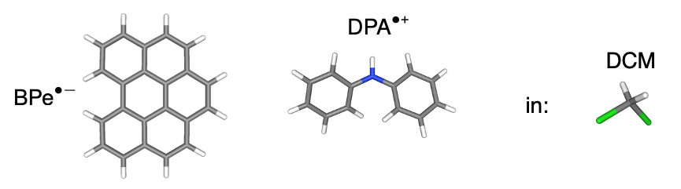
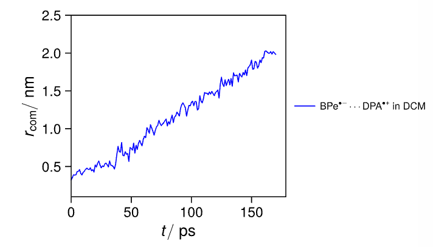
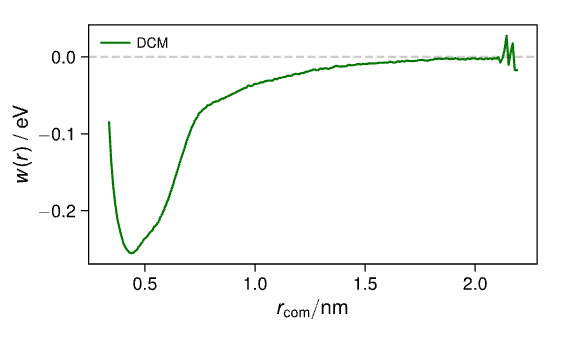
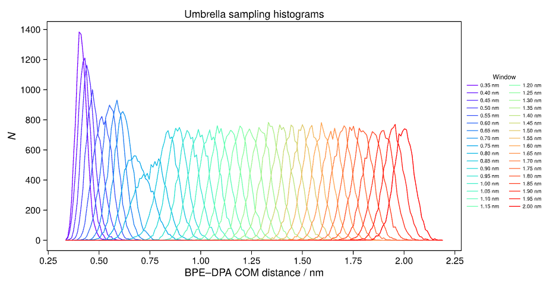

# Notes on Umbrella Sampling

This document describes the workflow used to set up, run, and analyze an umbrella-sampling calculation for the separation of the two molecular species, here: **BPe⁻** and **DPA⁺** in DCM:

<p align="center">
  
</p>

The reaction coordinate is the center-of-mass distance, $r_\mathrm{COM}$, between the two species.

The workflow consists of the following main stages:

1. Identify a suitable starting structure from the centered production trajectory.
2. Pull the two species apart to generate configurations over the desired distance range.
3. Extract structures at selected center-of-mass distances.
4. Create and run independent umbrella windows.
5. Collect the required files for WHAM.
6. Calculate and plot the potential of mean force (PMF).
7. Inspect the biased histograms and verify sufficient overlap between neighboring windows.

---

## 1. Identify the Starting Structure

The first step is to inspect the centered trajectory from the production simulation and identify a structure corresponding to the minimum distance between BPe⁻ and DPA⁺.

In this case, the minimum center-of-mass distance was approximately:

$$
r_\mathrm{COM} \approx 0.35\ \mathrm{nm}
$$

The structure at the selected trajectory frame was then exported as a `.gro` file. Here, the selected frame corresponded to **33500 ps**.

```bash
# Export the selected frame from the centered production trajectory
# as a .gro file. Here, the selected frame is at 33500 ps.

gmx trjconv \
    -f prod/prod-mol.xtc \
    -s prod/prod.tpr \
    -dump 33500 \
    -o pull/start.gro \
    -pbc mol \
    -center
```

### Notes

- `-f`: Input trajectory.
- `-s`: Structure/topology file associated with the trajectory.
- `-dump`: Time, in ps, at which the structure should be extracted.
- `-o`: Output structure file.
- `-pbc mol`: Keeps molecules whole across periodic boundaries.
- `-center`: Centers the selected structure according to the interactive selections.

The resulting file, `pull/start.gro`, is used as the starting configuration for the pulling simulation.

---

## 2. Pulling Simulation

The goal of the pulling simulation is to increase the distance between BPe⁻ and DPA⁺ in a controlled way. The pulling simulation is used to generate configurations covering the range of center-of-mass distances required for the umbrella windows.

The selected pulling parameters are:

| Parameter | Value |
|---|---:|
| Pulling rate | `0.01 nm/ps` |
| Harmonic force constant | `1000 kJ mol⁻¹ nm⁻²` |
| Initial distance | Approximately `0.35 nm` |
| Target distance | Approximately `2.0 nm` |
| Ensemble | NVT |
| Pressure coupling | Disabled |

These parameters are specified in `pull.mdp`.

### 2.1 Determining the Number of Steps

The pulling simulation should extend from approximately `0.3 nm` to `2.0 nm`.

The total pulling distance is therefore:

$$
\Delta r = 2.0 - 0.3 = 1.7\ \mathrm{nm}
$$

The integration timestep is:

$$
\Delta t = 0.002\ \mathrm{ps}
$$

The pulling rate is:

$$
v = 0.01\ \mathrm{nm/ps}
$$

The distance pulled per simulation step is:

$$
\Delta r_\mathrm{step}
=
\Delta t \times v
=
0.002\ \mathrm{ps/step}
\times
0.01\ \mathrm{nm/ps}
=
2\times10^{-5}\ \mathrm{nm/step}
$$

The required number of steps is:

$$
N_\mathrm{steps}
=
\frac{1.7\ \mathrm{nm}}
{0.002\ \mathrm{ps/step}\times0.01\ \mathrm{nm/ps}}
=
85\,000\ \mathrm{steps}
$$

The total simulation time is:

$$
t_\mathrm{sim}
=
85\,000\times0.002\ \mathrm{ps}
=
170\ \mathrm{ps}
$$

Therefore:

```text
Number of steps:       85000
Simulation time:       170 ps
```

These values should be specified in `pull.mdp`, for example:

```ini
dt      = 0.002
nsteps  = 85000
```

The exact `dt` and `nsteps` values should always be checked against the rest of the `.mdp` file.

### 2.2 Ensemble and Pressure Coupling

The pulling simulation was performed in the **NVT ensemble**, without pressure coupling.

This choice keeps the temperature controlled while avoiding changes in the simulation-box dimensions during the pulling process. Since the pulling coordinate is a molecular separation, it is important to maintain a stable box geometry and avoid pressure-coupling-induced changes that could complicate the interpretation of the distance coordinate.

The temperature should be controlled using the thermostat settings specified in `pull.mdp`.

### 2.3 Simulation-Box Size and the Maximum Separation

The simulation box in this example is approximately:

$$
5\times5\times5\ \mathrm{nm}^3
$$

The maximum molecular separation should be chosen carefully because of periodic boundary conditions.

A common rule is that the relevant separation should remain smaller than approximately half of the shortest box dimension:

$$
r_\mathrm{COM} < \frac{L_\mathrm{min}}{2}
$$

For a cubic box with $L_\mathrm{min}=5\ \mathrm{nm}$:

$$
\frac{L_\mathrm{min}}{2}=2.5\ \mathrm{nm}
$$

Thus, a target distance of approximately `2.0 nm` remains below the half-box-length limit of `2.5 nm`.

This consideration is important because distances approaching or exceeding half the box length can interact with periodic images. Depending on the molecular geometry, the periodic-boundary treatment, and the exact distance definition, the measured distance may become ambiguous or correspond to an unintended image of one of the molecules.

**Important:** The half-box-length criterion is a useful minimum-image guideline, not a complete guarantee that every molecular configuration is free of periodic-boundary artifacts. The molecular dimensions, solvent environment, and the specific GROMACS distance/pull setup should also be considered.

---

## 3. Running the Pulling Simulation

First, generate the binary input file using `grompp`:

```bash
gmx grompp \
    -f pull.mdp \
    -c pull/start.gro \
    -p topol.top \
    -n index.ndx \
    -o pull/pull.tpr
```

Then run the simulation:

```bash
gmx mdrun \
    -v \
    -deffnm pull/pull \
    -s pull/pull.tpr
```

The main output files will be written using the `pull/pull` prefix.

---

## 4. Inspecting the Pulling Trajectory

After the pulling simulation has finished, the trajectory should be inspected to verify that the distance increases as intended.

It is useful to:

- Plot the center-of-mass distance as a function of time.
- Confirm that the distance increases over the desired range.
- Inspect the molecular configurations visually.
- Check for unwanted molecular distortions, bad contacts, or periodic-boundary artifacts.
- Confirm that the two molecular species remain structurally intact during the pulling process.

### 4.1 Export a Centered Trajectory

To generate a centered trajectory in which molecules are kept whole:

```bash
gmx trjconv \
    -s pull/pull.tpr \
    -f pull/pull.xtc \
    -o pull/pull-mol.xtc \
    -pbc mol \
    -center
```

The command may prompt for index-group selections. Select the groups appropriate for centering and outputting the trajectory.

### 4.2 Calculate the Center-of-Mass Distance

The distance between the selected groups can be calculated using:

```bash
gmx distance \
    -f pull/pull-mol.xtc \
    -s pull/pull.tpr \
    -n index.ndx \
    -oav pull/com_dist.xvg
```

The index groups used for this calculation should correspond to the two molecular species, BPe⁻ and DPA⁺.

The resulting `pull/com_dist.xvg` file can be plotted to check whether the distance increases from approximately `0.3–0.35 nm` toward the desired maximum distance.

### 4.3 Visual Inspection with NGLView

The trajectory should also be inspected visually, for example using **NGLView**.

<p align="center">
  
</p>

Visual inspection can help identify:

- Molecules crossing periodic boundaries.
- Unphysical conformations.
- Severe steric clashes.
- Unexpected rotations or orientations.
- Unwanted interactions with periodic images.
- Structural changes that could affect the umbrella sampling.

A distance plot alone is not sufficient to guarantee that the pulling trajectory is physically suitable.

---

## 5. Plotting the Pulling Coordinate and Selecting Structures

The pulling trajectory can be analyzed using the `pyrene` workflow and the script:

```text
plot_pulling_rcom.py
```

<p align="center">
  
</p>

The script plots the center-of-mass trajectory and allows the user to provide a list of target distances using the `find` argument. These target distances determine which structures should be extracted from the trajectory.

For example, the requested distances could be:

```text
0.35
0.40
0.45
0.50
0.55
0.60
0.65
```

The exact syntax depends on the implementation of `plot_pulling_rcom.py`. Consult the script for the expected format of the `find` argument.

### 5.1 The `time_found.txt` File

The script generates a file called:

```text
time_found.txt
```

This file contains the time at which each requested center-of-mass distance is found in the pulling trajectory.

An example is:

```text
# time / ps, rcom / nm
1.000000000000000000e+00 3.499999999999999778e-01
2.000000000000000000e+00 3.999999999999999667e-01
1.700000000000000000e+01 4.499999999999999556e-01
3.500000000000000000e+01 4.999999999999999445e-01
2.900000000000000000e+01 5.499999999999999334e-01
2.300000000000000000e+01 5.999999999999998668e-01
4.300000000000000000e+01 6.499999999999999112e-01
```
---

Note: If your centered production trajectory already samples sufficiently the needed COM distances, no pulling simulation is required and you can just extract the wanted geometries from the prodcution trajectory instead.

## 6. Generate the Umbrella-Window Folders

The `time_found.txt` file can be used with:

```text
generate_umbreall_folders.py
```

The script automatically extracts `.gro` structures from the pulling trajectory and places them in dedicated folders inside the umbrella-sampling directory.

For example:

```text
umbrella/
├── umbrella_035/
│   └── start.gro
├── umbrella_040/
│   └── start.gro
├── umbrella_045/
│   └── start.gro
└── ...
```

The folder `umbrella_035` corresponds to a target center-of-mass distance of approximately:

$$
r_\mathrm{COM}=0.35\ \mathrm{nm}
$$

The exact folder naming convention depends on the script. It is important to use a consistent convention throughout the analysis.

### 6.1 Files Copied into Each Window

The script should also copy the files required to run each umbrella simulation.

For example:

```python
FILES_TO_COPY = [
    "index.ndx",
    "topol.top",
    "BPe.itp",
    "DCM.itp",
    "DPA.itp",
]
```

These files provide the topology, molecular parameters, and index groups required for the simulation.

Depending on the topology structure, additional files may be required, such as:

- Other `.itp` files included by `topol.top`.
- Position-restraint files.
- Force-field files or directories.
- A specific `umbrella.mdp` file.
- Any custom scripts needed for the simulation.

Before submitting the jobs, verify that all included topology files are available in the expected locations and that the relative paths in `topol.top` are valid.

---

## 7. Umbrella-Sampling Parameters

Each umbrella window uses a harmonic potential to restrain the center-of-mass distance around a selected target value.

The umbrella simulations use the parameters specified in:

```text
umbrella.mdp
```

In this setup, each window is simulated for approximately **5.5 ns**, using a timestep of **1 fs**:

```ini
dt = 0.001
```

The simulations are performed in the **NVT ensemble**, using a Nose–Hoover thermostat at approximately **298 K**.

A timestep of `2 fs` was previously tested, but simulations in windows with very small center-of-mass distances became unstable or “blew up.” The timestep was therefore reduced to `1 fs` to improve numerical stability and equilibration in these difficult windows.

Reducing the timestep can help resolve fast motions and avoid integration instabilities, but it does not replace the need to inspect the configurations for bad contacts, excessive forces, or poor initial structures.

### 7.1 Umbrella-Sampling Pull Code

The relevant section of `umbrella.mdp` is:

```ini
; ==========================================================
; Umbrella sampling
; ==========================================================

pull                    = yes
pull-ngroups            = 2

pull-group1-name        = BPE
pull-group2-name        = DPA

pull-ncoords            = 1

pull-coord1-type        = umbrella
pull-coord1-geometry    = distance
pull-coord1-groups      = 1 2
pull-coord1-dim         = Y Y Y

pull-coord1-init        = TARGET_DISTANCE
pull-coord1-rate        = 0
pull-coord1-k           = 1000

pull-nstxout             = 500
pull-nstfout             = 500
```

The placeholder `TARGET_DISTANCE` must be replaced with the target distance for the particular umbrella window, for example `0.35`, `0.40`, `0.45`, etc. which the `generate_umbrella_folders.py` file does automatically. 

### 7.2 Explanation of the Parameters

#### `pull = yes`

Activates the GROMACS pull code.

```ini
pull = yes
```

Without this setting, the pull-related parameters are not used.

#### `pull-ngroups = 2`

Defines two pull groups:

```ini
pull-ngroups = 2
```

The two groups are:

```ini
pull-group1-name = BPE
pull-group2-name = DPA
```

These names must correspond to valid index groups or groups recognized by the topology/index setup.

#### `pull-ncoords = 1`

Defines one pull coordinate:

```ini
pull-ncoords = 1
```

Only one reaction coordinate is restrained: the distance between BPE and DPA.

#### `pull-coord1-type = umbrella`

Specifies a harmonic umbrella restraint:

```ini
pull-coord1-type = umbrella
```

The restraint applies a harmonic potential around a target distance:

$$
U(r)
=
\frac{1}{2}k(r-r_0)^2
$$

where:

- $r$ is the instantaneous distance.
- $r_0$ is the target distance for the current umbrella window.
- $k$ is the force constant.

#### `pull-coord1-geometry = distance`

Defines the reaction coordinate as the distance between the two pull groups:

```ini
pull-coord1-geometry = distance
```

#### `pull-coord1-groups = 1 2`

Specifies that the coordinate is calculated between pull group 1 and pull group 2:

```ini
pull-coord1-groups = 1 2
```

In this case, the coordinate is the distance between BPE and DPA.

#### `pull-coord1-dim = Y Y Y`

Allows the distance to be calculated in all three Cartesian directions:

```ini
pull-coord1-dim = Y Y Y
```

The three entries correspond to the x, y, and z directions. With all three directions enabled, the restraint acts on the full three-dimensional distance.

#### `pull-coord1-init = TARGET_DISTANCE`

Sets the reference distance for the umbrella window:

```ini
pull-coord1-init = TARGET_DISTANCE
```

For example, the window centered at `0.35 nm` should use:

```ini
pull-coord1-init = 0.35
```

The value should be changed for every umbrella window.

#### `pull-coord1-rate = 0`

Disables continuous movement of the reference position:

```ini
pull-coord1-rate = 0
```

This is appropriate for umbrella sampling because the reference distance should remain fixed during the simulation. The system is restrained around a stationary target rather than being pulled continuously.

#### `pull-coord1-k = 1000`

Sets the harmonic force constant:

```ini
pull-coord1-k = 1000
```

The force constant is expressed in:

$$
\mathrm{kJ\ mol^{-1}\ nm^{-2}}
$$

A larger value produces a stronger restraint and a narrower distribution around the target distance. A smaller value permits larger fluctuations around the target.

The force constant should be selected together with the desired window spacing and the expected fluctuations in the reaction coordinate.

#### `pull-nstxout = 500`

Controls how frequently the pull-coordinate positions are written:

```ini
pull-nstxout = 500
```

The exact output and interpretation depend on the GROMACS version and pull-code settings. The output frequency should be sufficiently high to resolve the fluctuations of the restrained coordinate.

#### `pull-nstfout = 500`

Controls how frequently the pull-coordinate forces are written:

```ini
pull-nstfout = 500
```

This is useful for monitoring the restraint forces and diagnosing overly strong forces or problematic windows.

---

## 8. Generate and Submit the Umbrella Windows

Running:

```text
generate_umbreall_folders.py
```

creates the directories and files required for each umbrella window.

The script also generates a SLURM job file called:

```text
umbrella.job
```

inside each umbrella directory.

```bash
#!/bin/bash

#SBATCH --job-name=BPe_DPA_035
#SBATCH --output=slurm-%J.out
#SBATCH --error=slurm-%J.err
#SBATCH --nodes=1
#SBATCH --ntasks=1
#SBATCH --cpus-per-task=32
#SBATCH --time=00-5:00:00
#SBATCH --partition=shared-cpu

module load GCC/11.3.0 CUDA/11.4.1 OpenMPI/4.1.4 GROMACS/2023.1

gmx grompp \
    -f umbrella.mdp \
    -c start.gro \
    -p topol.top \
    -n index.ndx \
    -o umbrella.tpr

if [ $? -ne 0 ]; then
    echo "grompp failed."
    exit 1
fi

gmx mdrun \
    -nt 32 \
    -v \
    -deffnm umbrella
```

### 8.1 Job-File Explanation

#### SLURM directives

The `#SBATCH` lines define the resources requested from the cluster.

For example:

```bash
#SBATCH --job-name=BPe_DPA_035
```

Sets the job name.

```bash
#SBATCH --output=slurm-%J.out
#SBATCH --error=slurm-%J.err
```

Write standard output and standard error to separate files. `%J` is replaced by the SLURM job identifier.

```bash
#SBATCH --nodes=1
#SBATCH --ntasks=1
#SBATCH --cpus-per-task=32
```

Requests one node, one task, and 32 CPU cores for that task.

```bash
#SBATCH --time=00-5:00:00
```

Requests a maximum wall-clock time of five days.

```bash
#SBATCH --partition=shared-cpu
```

Requests the `shared-cpu` partition.

The requested resources should be adapted to the cluster configuration and the computational requirements of the simulations.

#### Loading the software environment

```bash
module load GCC/11.3.0 CUDA/11.4.1 OpenMPI/4.1.4 GROMACS/2023.1
```

Loads the compiler, CUDA, MPI, and GROMACS modules required on the cluster.

The module names and versions must match the software environment available on the target cluster.

#### Running `grompp`

```bash
gmx grompp \
    -f umbrella.mdp \
    -c start.gro \
    -p topol.top \
    -n index.ndx \
    -o umbrella.tpr
```

This command processes the molecular dynamics parameters, starting structure, topology, and index file to generate the binary run input file:

```text
umbrella.tpr
```

The `tpr` file contains the information needed to run the simulation.

The exit-status check:

```bash
if [ $? -ne 0 ]; then
    echo "grompp failed."
    exit 1
fi
```

stops the job if `grompp` fails. This prevents the subsequent `mdrun` command from running with an invalid or missing input file.

#### Running `mdrun`

```bash
gmx mdrun \
    -nt 32 \
    -v \
    -deffnm umbrella
```

Runs the umbrella simulation using 32 threads.

The `-deffnm umbrella` option sets the output-file prefix. Typical output files include:

```text
umbrella.tpr
umbrella.xtc
umbrella.edr
umbrella.log
umbrella_pullx.xvg
```

The exact files depend on the `.mdp` settings and the GROMACS version.

---

## 9. Submit All Umbrella Jobs Automatically

Submitting each umbrella simulation manually would be time-consuming. Therefore, a script called:

```text
submit_jobs.sh
```

can be copied into the umbrella root directory on the cluster.

The script should loop over the umbrella-window directories, locate the corresponding job file, and submit each job to SLURM.

A typical directory structure is:

```text
umbrella/
├── submit_jobs.sh
├── umbrella_035/
│   ├── umbrella.job
│   ├── umbrella.mdp
│   ├── start.gro
│   └── ...
├── umbrella_040/
│   ├── umbrella.job
│   ├── umbrella.mdp
│   ├── start.gro
│   └── ...
└── ...
```

Before running the submission script, verify:

- Every umbrella directory contains the required files.
- The target distances are correct.
- The topology and index files are valid.
- The correct `umbrella.mdp` is present in each directory.
- The job file requests appropriate resources.
- The initial structures do not contain obvious bad contacts.

The script can then be executed from the umbrella root directory:

```bash
bash submit_jobs.sh
```

The exact submission command inside the script will typically be based on:

```bash
sbatch umbrella.job
```

---

## 10. Prepare the WHAM Analysis

After all umbrella simulations have finished, the output files must be collected for the WHAM analysis.

The `wham` directory should be copied into the umbrella root directory.

For example:

```text
umbrella/
├── umbrella_035/
├── umbrella_040/
├── umbrella_045/
├── ...
└── wham/
    ├── get_files.sh
    └── ...
```

The `wham` directory contains a script called:

```text
get_files.sh
```

Open this script and add the **absolute path** to the umbrella root directory.

The absolute path is required so that the generated file lists contain valid paths to the simulation output files.

### 10.1 Generate the Pull-Coordinate File List

Run the script from the appropriate directory:

```bash
bash get_files.sh
```

The script searches the umbrella directories and creates a file called:

```text
pullx-files.dat
```

This file contains the paths to the pull-coordinate output files from the umbrella windows.

An example is:

```text
.../umbrella_035/umbrella_pullx.xvg
.../umbrella_040/umbrella_pullx.xvg
.../umbrella_045/umbrella_pullx.xvg
...
```

Each line corresponds to one umbrella window.

### 10.2 Generate the TPR File List

The same script should also generate:

```text
tpr-files.dat
```

This file contains the paths to the `.tpr` files associated with each umbrella window.

An example is:

```text
.../umbrella_035/umbrella.tpr
.../umbrella_040/umbrella.tpr
.../umbrella_045/umbrella.tpr
```

The `.tpr` files contain the simulation parameters and the reference information needed by WHAM.

---

## 11. WHAM Analysis

The pull-coordinate files and TPR files are used by the **Weighted Histogram Analysis Method (WHAM)** implemented in GROMACS.

Each umbrella window samples a biased probability distribution:

$$
P_i^\mathrm{biased}(r)
$$

where $i$ denotes the umbrella window.

The harmonic restraint modifies the probability distribution in each window. WHAM combines the distributions from all windows to estimate the unbiased probability distribution:

$$
P(r)
$$

The potential of mean force is then calculated from the unbiased probability distribution:

$$
\mathrm{PMF}(r)
=
-k_\mathrm{B}T\ln P(r)+C
$$

where:

- $k_\mathrm{B}$ is the Boltzmann constant.
- $T$ is the temperature.
- $P(r)$ is the unbiased probability distribution.
- $C$ is an arbitrary additive constant.

The PMF is therefore defined up to a constant offset. Only relative free-energy differences are physically meaningful.

### 11.1 Running WHAM

The WHAM calculation can be run using:

```bash
gmx  wham \
    -it tpr-files.dat \
    -ix pullx-files.dat \
    -o pmf.xvg \
    -hist histogram.xvg \
    -b 500 \
    -temp 298.15 \
    -bsres bsres.xvg \
    -nBootstrap 200 \
    -bs-method b-hist
```

### 11.2 Explanation of the WHAM Options

#### `-it tpr-files.dat`

```bash
-it tpr-files.dat
```

Provides the list of TPR files, one for each umbrella window.

The TPR files contain the simulation information and the restraint reference values required for the WHAM analysis.

#### `-ix pullx-files.dat`

```bash
-ix pullx-files.dat
```

Provides the list of pull-coordinate files, one for each umbrella window.

These files contain the sampled reaction-coordinate values as a function of time.

#### `-o pmf.xvg`

```bash
-o pmf.xvg
```

Specifies the output file containing the calculated PMF.

#### `-hist histogram.xvg`

```bash
-hist histogram.xvg
```

Writes the histograms associated with the umbrella windows.

These histograms are useful for checking whether neighboring windows overlap sufficiently.

Good overlap is important because WHAM combines information from neighboring biased distributions to reconstruct the unbiased distribution.

#### `-b 500`

```bash
-b 500
```

Discards the first `500 ps` of each trajectory before performing the analysis.

This is intended to remove the initial equilibration period. The appropriate equilibration time should be determined by inspecting the trajectories and checking when the windows have reached stable sampling.

#### `-temp 298.15`

```bash
-temp 298.15
```

Sets the temperature used in the WHAM analysis to:

$$
T=298.15\ \mathrm{K}
$$

This should match the temperature used in the umbrella simulations.

#### `-bsres bsres.xvg`

```bash
-bsres bsres.xvg
```

Specifies the output file for bootstrap results.

Bootstrap analysis can be used to estimate uncertainty in the PMF by repeatedly resampling the available data.

#### `-nBootstrap 200`

```bash
-nBootstrap 200
```

Requests 200 bootstrap iterations.

Increasing the number of bootstrap iterations generally improves the statistical stability of the uncertainty estimate but increases the computational cost.

#### `-bs-method b-hist`

```bash
-bs-method b-hist
```

Selects the bootstrap method based on histogram resampling.

### 11.3 WHAM Output Files

The main output files are:

| File | Description |
|---|---|
| `pmf.xvg` | Calculated potential of mean force |
| `histogram.xvg` | Histograms of the umbrella windows |
| `bsres.xvg` | Bootstrap uncertainty results |

The PMF is stored in:

```text
pmf.xvg
```

---

## 12. Plot the PMF

After the WHAM calculation has completed, plot the PMF using:

```text
plot_PMF.py
```

<p align="center">
  
</p>

The PMF plot should be inspected for:

- The overall shape of the free-energy profile.
- Local minima and maxima.
- Regions with large statistical uncertainty.
- Discontinuities or unexpected features.
- Regions where the sampling is insufficient.
- Sensitivity to the equilibration cutoff.
- Sensitivity to the selected force constant and window spacing.

The PMF should not be interpreted without first checking the quality of the umbrella sampling.

In particular, a smooth-looking PMF does not automatically guarantee adequate sampling. The histogram overlap, convergence, and uncertainty estimates should also be assessed.

---

## 13. Plot the Biased Histograms

The biased histograms from the individual umbrella windows should be plotted using:

```text
plot_umbrella_windows.py
```

<p align="center">
  
</p>

The histograms show how the sampled center-of-mass distances are distributed in each window.

A well-designed umbrella-sampling calculation should generally have sufficient overlap between neighboring histograms.

### 13.1 Why Histogram Overlap Matters

Each umbrella window samples a limited region of the reaction coordinate because of the harmonic restraint. WHAM combines the windows to reconstruct the unbiased distribution.

If neighboring windows have little or no overlap:

- The relative free-energy offsets between windows become poorly constrained.
- The reconstructed PMF may contain artificial discontinuities.
- Uncertainties can become large.
- The result may be sensitive to the analysis settings.
- Some regions of the reaction coordinate may be poorly sampled.

If the histograms overlap sufficiently, the sampled distributions provide a continuous connection between neighboring windows.

### 13.2 What to Check

When inspecting the histogram plot:

- Neighboring windows should overlap in the reaction coordinate.
- There should not be large unsampled gaps.
- No window should be completely isolated from its neighbors.
- Very narrow distributions should be examined carefully.
- Windows with unusually broad or displaced distributions should be investigated.
- Windows at very small distances should be checked for bad contacts or poor equilibration.

The appropriate degree of overlap depends on the force constant, temperature, coordinate definition, and spacing between umbrella windows. Histogram overlap should therefore be evaluated together with convergence and uncertainty estimates rather than using a single universal numerical threshold.

---

## 14. Recommended Quality-Control Checklist

Before trusting the final PMF, check the following.

### Starting structure

- [ ] The initial structure corresponds to the intended minimum-distance configuration.
- [ ] Both molecules are whole and correctly treated under periodic boundary conditions.
- [ ] No severe steric clashes or unrealistic geometries are present.

### Pulling simulation

- [ ] The pulling rate is correctly specified.
- [ ] The harmonic force constant is correct.
- [ ] The number of steps and total simulation time are consistent.
- [ ] The pulling distance remains within a suitable range for the simulation box.
- [ ] The center-of-mass distance increases as expected.
- [ ] The trajectory has been visually inspected.

### Umbrella-window generation

- [ ] The target distances are correct.
- [ ] The extracted `.gro` structures correspond to the requested distances.
- [ ] Every window contains all required topology and index files.
- [ ] The `TARGET_DISTANCE` value is correctly set for every window.
- [ ] The umbrella windows cover the complete reaction-coordinate range.

### Umbrella simulations

- [ ] All jobs completed successfully.
- [ ] No window experienced a simulation crash or numerical instability.
- [ ] The timestep is appropriate for the most difficult windows.
- [ ] The temperature is stable.
- [ ] The restrained distance samples around the intended target.
- [ ] The equilibration period is sufficient.
- [ ] The production trajectories are long enough for the intended analysis.

### WHAM analysis

- [ ] The pull-coordinate and TPR file lists contain the same number of entries.
- [ ] The file order is consistent.
- [ ] All paths are valid.
- [ ] The equilibration cutoff is justified.
- [ ] The temperature matches the simulations.
- [ ] The PMF is checked for convergence.
- [ ] Bootstrap uncertainties are inspected.
- [ ] The biased histograms show sufficient overlap.
- [ ] No major gaps occur between neighboring windows.
